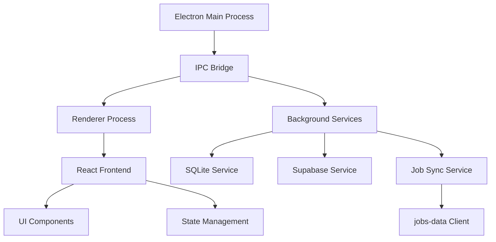
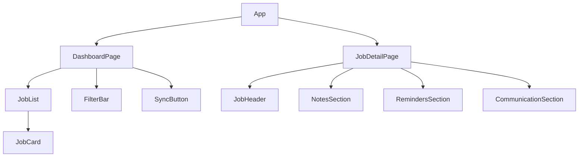

# Job Tracker - System Patterns

## Architecture Overview

### Desktop Application (Electron)


## Core Components

### 1. Main Process (Electron)
- Application lifecycle management
- Window management
- System tray integration
- IPC communication
- Background service orchestration

### 2. Renderer Process (React)
- User interface rendering
- State management (Zustand)
- Component hierarchy
- Event handling
- Real-time updates

### 3. Data Layer
- SQLite local database
- jobs-data integration
- Supabase cloud sync
- Data models and schemas
- Migration management
- Query optimization

### 4. Background Services
- jobs-data sync service
- Notification service
- Reminder service
- Communication logger
- Data backup service

## Design Patterns

### 1. Repository Pattern
```typescript
interface IJobRepository {
  findAll(): Promise<Job[]>;
  findById(id: string): Promise<Job>;
  update(job: Job): Promise<void>;
  delete(id: string): Promise<void>;
  sync(): Promise<void>;
}

// jobs-data specific repository
interface IJobsDataRepository {
  fetchJobs(): Promise<Job[]>;
  mapToJobModel(jobsDataJob: any): Job;
  getLastSyncTimestamp(): Promise<Date>;
  setLastSyncTimestamp(date: Date): Promise<void>;
}
```

### 2. Service Pattern
```typescript
interface IJobService {
  fetchJobs(): Promise<void>;
  updateStatus(jobId: string, status: JobStatus): Promise<void>;
  addNote(jobId: string, note: Note): Promise<void>;
  setReminder(jobId: string, reminder: Reminder): Promise<void>;
}

interface IJobsDataService {
  syncJobsFromSource(): Promise<void>;
  handleJobsDataUpdate(): Promise<void>;
  validateJobData(data: any): boolean;
}
```

### 3. Observer Pattern
```typescript
interface IJobObserver {
  onJobUpdated(job: Job): void;
  onJobStatusChanged(jobId: string, status: JobStatus): void;
  onSyncComplete(): void;
}
```

## Data Models

### Job Application
```typescript
interface JobApplication {
  id: string;
  title: string;
  company: string;
  status: JobStatus;
  appliedDate: Date;
  deadline?: Date;
  location: string;
  salary?: string;
  notes: Note[];
  reminders: Reminder[];
  communications: CommunicationLog[];
  lastSync: Date;
}
```

### Supporting Models
```typescript
interface Note {
  id: string;
  jobId: string;
  content: string;
  createdAt: Date;
}

interface Reminder {
  id: string;
  jobId: string;
  title: string;
  dueDate: Date;
  completed: boolean;
}

interface CommunicationLog {
  id: string;
  jobId: string;
  type: CommunicationType;
  content: string;
  date: Date;
  contact?: string;
}
```

## State Management

### Zustand Store Structure
```typescript
interface JobStore {
  jobs: JobApplication[];
  filters: JobFilters;
  loading: boolean;
  error: string | null;
  
  // Actions
  fetchJobs(): Promise<void>;
  updateJob(job: JobApplication): Promise<void>;
  setFilters(filters: JobFilters): void;
  syncWithCloud(): Promise<void>;
}
```

## Database Schema

### SQLite Tables
```sql
CREATE TABLE jobs (
  id TEXT PRIMARY KEY,
  title TEXT NOT NULL,
  company TEXT NOT NULL,
  status TEXT NOT NULL,
  applied_date TEXT NOT NULL,
  deadline TEXT,
  location TEXT,
  salary TEXT,
  last_sync TEXT NOT NULL
);

CREATE TABLE notes (
  id TEXT PRIMARY KEY,
  job_id TEXT NOT NULL,
  content TEXT NOT NULL,
  created_at TEXT NOT NULL,
  FOREIGN KEY (job_id) REFERENCES jobs (id)
);

CREATE TABLE reminders (
  id TEXT PRIMARY KEY,
  job_id TEXT NOT NULL,
  title TEXT NOT NULL,
  due_date TEXT NOT NULL,
  completed INTEGER NOT NULL,
  FOREIGN KEY (job_id) REFERENCES jobs (id)
);

CREATE TABLE communications (
  id TEXT PRIMARY KEY,
  job_id TEXT NOT NULL,
  type TEXT NOT NULL,
  content TEXT NOT NULL,
  date TEXT NOT NULL,
  contact TEXT,
  FOREIGN KEY (job_id) REFERENCES jobs (id)
);
```

## Component Hierarchy



## Error Handling

### Error Types
```typescript
enum ErrorType {
  NETWORK_ERROR = 'NETWORK_ERROR',
  SYNC_ERROR = 'SYNC_ERROR',
  DATABASE_ERROR = 'DATABASE_ERROR',
  VALIDATION_ERROR = 'VALIDATION_ERROR'
}

interface AppError {
  type: ErrorType;
  message: string;
  details?: any;
}
```

## Security Patterns

### Authentication
- Supabase email/password auth
- Token management
- Session persistence
- Secure storage

### Data Protection
- Encrypted local storage
- Secure IPC communication
- Protected API endpoints
- Data validation 